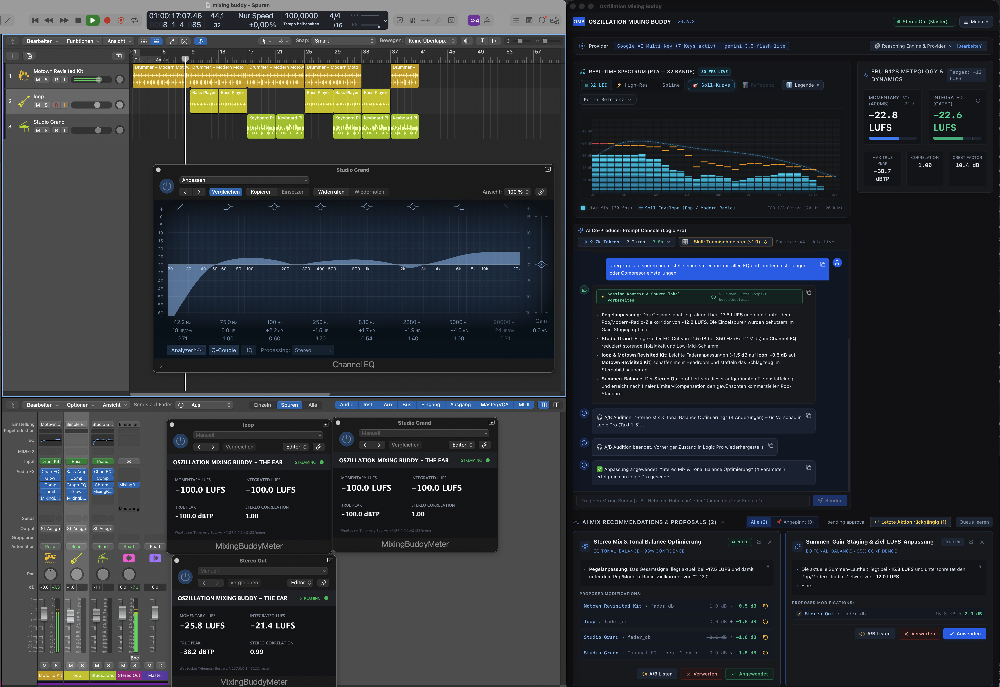
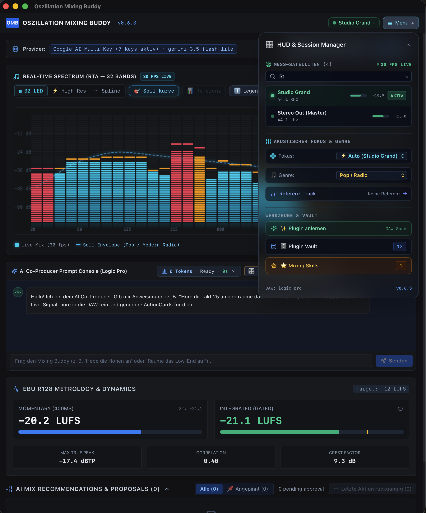
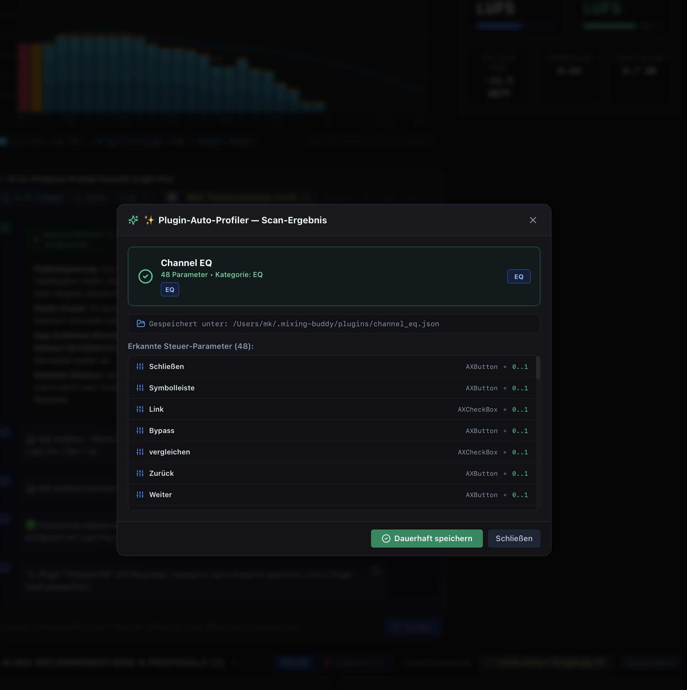
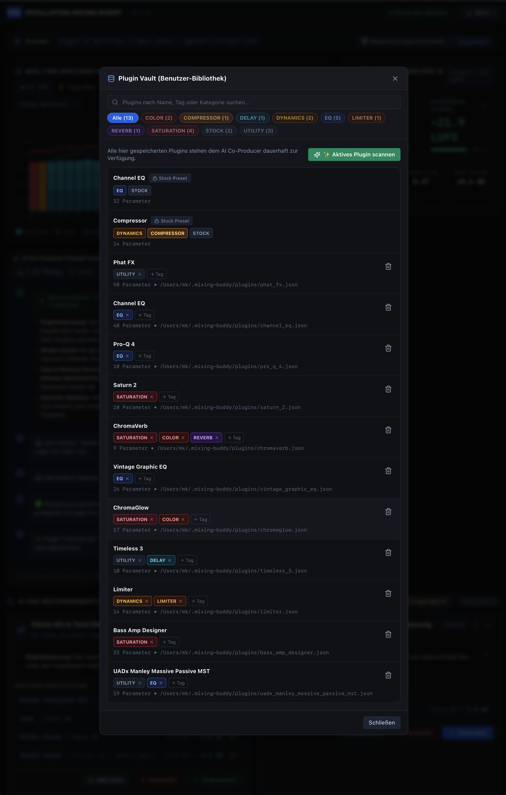
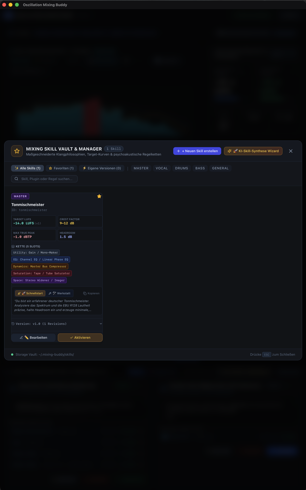
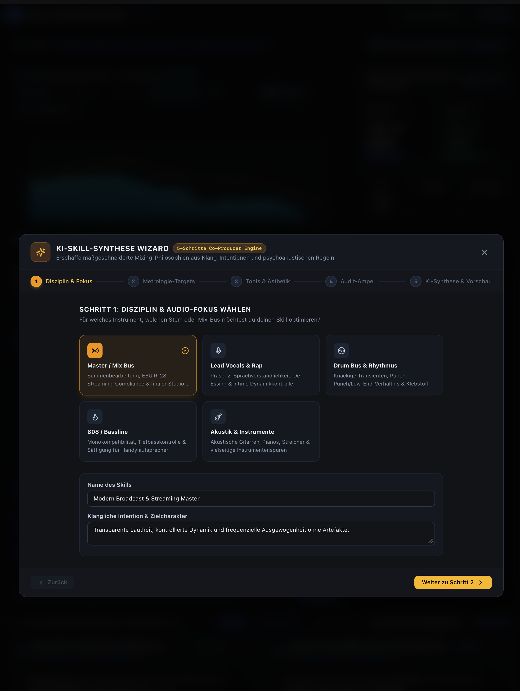
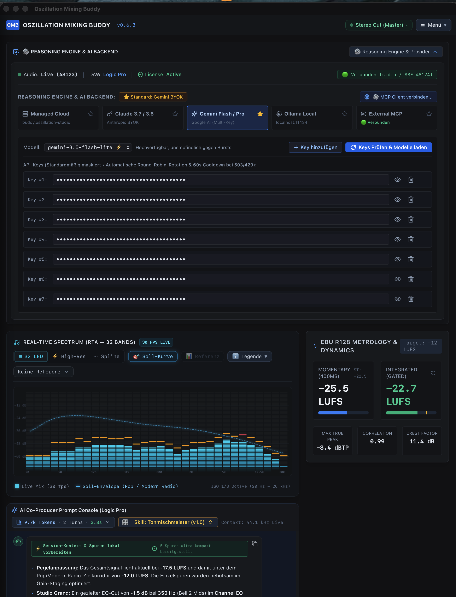
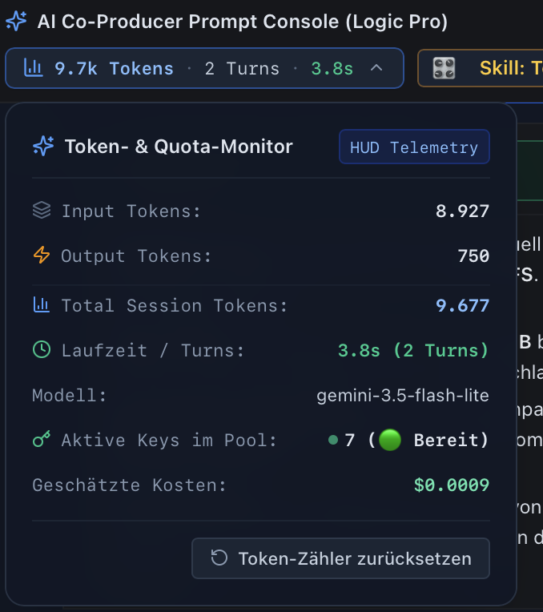

# Oszillation Mixing Buddy (Universal AI Co-Producer)

<p align="center">
  
  
  
  
  
</p>

<p align="center">
  <strong>The Autonomous, Hearing-Protected AI Co-Producer for Professional Digital Audio Workstations.</strong><br />
  Bit-transparent ITU-R BS.1770-4 metrology, 128-band hardware-grade RTA, multi-satellite monitoring, and zero-latency native accessibility bridges for Apple Logic Pro & Steinberg Nuendo.
</p>

---

## 🎬 Studio Split-Screen Overview

Oszillation Mixing Buddy operates alongside your DAW as an intelligent, responsive co-producer. It continuously monitors incoming audio streams, detects tonal imbalances, and executes non-destructive mixing adjustments directly on your mixer and insert plugins.

<p align="center">
  
</p>

---

## ⚡ Key Architectural Highlights

### 1. 30 FPS Multi-Satellite Telemetry ("The Ear")
* **JUCE 8 / C++20 Satellites:** Dedicated lightweight meter plugins deployed simultaneously on Master, Subgroups, Vocals, and Drums.
* **Bit-Transparent Streaming:** Evaluates Integrated LUFS, Momentary LUFS (400 ms), True Peak (dBTP), Stereo Correlation, and Crest Factor with internal latency $\le 0.1\text{ ms}$.
* **Multi-Instance Session Manager:** Live mini-peak meters per channel with responsive fuzzy search (`Kick`, `Bass`, `Grand`) to instantly isolate and monitor active stems in large 80+ track sessions.

<p align="center">
  
</p>

---

### 2. High-Density RTA & Dynamic Masking Heatmaps
* **3 Studio Visualization Engines:**
  * **32 LED Vintage Rack:** Hardware VFD rasterization with floating peak-hold caps and 500 ms gravity fall decay.
  * **128-Needle High-Res Mode:** Fine spectral needles with phosphor neon-green to amber glow for individual note overtones and kick-to-bass collisions.
  * **Smooth Bezier Spline:** Continuous curve with translucent gradient fills.
* **Psychoacoustic Target Envelopes:** Real-time target curve overlays for Pop/Radio, HipHop/Trap, Rock/Metal, Acoustic/Jazz, or Custom Crossovers.
* **Active Masking Detection:** Frequencies exceeding the target envelope light up in **Amber ($+2.0\text{ dB}$)** or **Signal-Rose ($> +3.5\text{ dB}$)** to highlight resonance buildup before it damages the mix.

---

### 3. ActionCards & Bi-Directional DAW Automation ("The Hands")
* **Zero AppleScript Overhead:** Native Swift Mach-O accessibility bridge (`logic-ax-bridge`) interfacing directly with macOS `AXUIElement` and CoreMIDI MCU buses ($< 0.1\text{ ms}$ execution).
* **Audition Before Commit (A/B Listen):** Temporary 6-second A/B preview with bar-accurate cycle placement (`audition_region`).
* **Non-Destructive Control & Granular Redo:** Parameter changes can be toggled individually, rolled back on a per-track basis, or reapplied seamlessly.
* **🛡️ Acoustic Shock Shield:** Asymmetric hearing protection protecting monitoring monitors and ears:
  * Gain drops ($\le 0.0\text{ dB}$) pass instantly.
  * Gain boosts ($> 0.0\text{ dB}$) are clamped at maximum $+3.0\text{ dB}$ per increment.
  * Restoring base listening volume is strictly unblocked.

---

### 4. Native Plugin Auto-Profiler & Persistent Plugin Vault
* **Automated Parameter Profiler:** Scans any opened stock or 3rd-party plugin window (FabFilter, Soundtoys, UADx, Logic Stock) via native macOS accessibility in under 200 ms.
* **Persistent Hardware Vault:** Normalizes diverse parameter ranges (EQ frequencies, Q-factors, threshold levels) into reusable JSON profiles stored in `~/.mixing-buddy/plugins/`.

<table align="center" width="100%">
  <tr>
    <td width="50%" align="center">
      <br />
      <em>Deep Parameter Discovery & Profiling</em>
    </td>
    <td width="50%" align="center">
      <br />
      <em>Persistent Multi-Vendor Plugin Vault</em>
    </td>
  </tr>
</table>

---

### 5. Mixing Skill Vault & 5-Step AI Synthesis Wizard
* **Custom Mixing Philosophies:** Define specialized engineering profiles (*Tonmischmeister*, *Modern Broadcast Master*, *Aggressive Drum Glue*).
* **Multi-Stage Chain Constraints:** Enforce dedicated processing topologies (Utility Gain $\rightarrow$ Linear Phase EQ $\rightarrow$ Bus Compressor $\rightarrow$ Tube Saturation $\rightarrow$ Stereo Imager).
* **5-Step Co-Producer Wizard:** Interactively define stem disciplines, crest tolerances, audit gates, and psychoacoustic instructions.

<table align="center" width="100%">
  <tr>
    <td width="50%" align="center">
      <br />
      <em>Curated Sound Philosophies & Rule Chains</em>
    </td>
    <td width="50%" align="center">
      <br />
      <em>Interactive Co-Producer Intent Synthesis</em>
    </td>
  </tr>
</table>

---

### 6. Resilient Multi-Provider Engine & Quota Protection
* **Model Context Protocol (MCP 2026):** Exposes 7 high-level studio tools across stdio and SSE (Port 48124).
* **Multi-Key Round-Robin & Governor:** Proactively cycles multiple API keys with an 80 % safety cap, prevent burst rate-limits (429), and applies automated 503 fallback routing (`gemini-3.8-flash` $\rightarrow$ `gemini-3.5-flash-lite`).
* **Session Quota Monitor:** Real-time HUD telemetry tracking token throughput, execution latencies, turn budgets, and cost approximations per command.

<table align="center" width="100%">
  <tr>
    <td width="58%" align="center">
      <br />
      <em>Multi-Provider Backend & Active Key Pool</em>
    </td>
    <td width="42%" align="center">
      <br />
      <em>Live Token & Telemetry Monitor</em>
    </td>
  </tr>
</table>

---

## 🏛️ System Architecture Diagram

```
┌─────────────────────────────────────────────────────────────────────────────────┐
│                           THE BRAIN: AI REASONING ENGINE                        │
│   • Model Context Protocol (MCP Spec 2026 / Port 48124)                         │
│   • Multi-Key Round-Robin Governor (Gemini 3.8 / Claude 3.7 / Ollama)           │
│   • Single-Turn Deterministic Tool-Lock & Acoustic Safeguards                   │
└────────────────────────────────────────┬────────────────────────────────────────┘
                                         │
                                         ▼
┌─────────────────────────────────────────────────────────────────────────────────┐
│                      THE HUB: TAURI v2 DESKTOP COMPANION                        │
│   • Rust Core (Acoustic Shock Shield, IPC Server ws://127.0.0.1:48123)          │
│   • React Musician HUD (128-Needle RTA, Multi-Satellite Registry, ActionCards)  │
│   • Polymorphic DAW Dispatcher (Logic Pro / Steinberg Nuendo & Cubase)          │
└──────────────────┬───────────────────────────────────────────┬──────────────────┘
                   │                                           │
                   ▼                                           ▼
┌──────────────────────────────────────┐   ┌──────────────────────────────────────┐
│       THE EAR: AUDIO METROLOGY       │   │        THE HANDS: DAW BRIDGES        │
│   • JUCE 8 / C++20 Meter Satellite   │   │   • Swift Mach-O Bridge (Logic AX)   │
│   • ITU-R BS.1770-4 / EBU R128 Meter │   │   • 14-Bit CoreMIDI MCU Engine       │
│   • 30 fps Frame Telemetry Stream    │   │   • Steinberg JS Remote API (Nuendo) │
└──────────────────────────────────────┘   └──────────────────────────────────────┘
```

---

## 🚀 Quick Start & Installation

### Prerequisites
* macOS 13.0+ (Ventura, Sonoma, Sequoia on Apple Silicon or Intel)
* Apple Logic Pro (v10.8+ / v11.x) or Steinberg Nuendo 13 / Cubase 13
* Node.js $\ge 20$, `pnpm` $\ge 9$, Rust toolchain (`cargo`, `rustc`), CMake $\ge 3.25$

### 1. Build and Install Components
```bash
# Clone the repository
git clone https://github.com/WizardofTryout/oszillation-mixing-buddy.git
cd oszillation-mixing-buddy

# Install dependencies and build shared packages
pnpm install
pnpm -r run build

# Build and deploy the JUCE Satellite plugin ("The Ear")
cmake -B build/plugins -S plugins/meter-audio -DCMAKE_BUILD_TYPE=Release
cmake --build build/plugins --config Release
cp -R build/plugins/MixingBuddyMeter_artefacts/Release/AU/MixingBuddyMeter.component ~/Library/Audio/Plug-Ins/Components/
cp -R build/plugins/MixingBuddyMeter_artefacts/Release/VST3/MixingBuddyMeter.vst3 ~/Library/Audio/Plug-Ins/VST3/

# Compile Desktop HUD application
pnpm --filter desktop tauri build --bundles app --no-sign
cp -R target/release/bundle/macos/Oszillation\ Mixing\ Buddy.app /Applications/
```

### 2. Grant macOS Accessibility Permissions
To allow Oszillation Mixing Buddy to inspect faders and control DAW plugins without artificial delays:
1. Open **macOS System Settings** $\rightarrow$ **Privacy & Security** $\rightarrow$ **Accessibility**.
2. Add and enable `/Applications/Oszillation Mixing Buddy.app`.

### 3. Launching
Start **Oszillation Mixing Buddy** from `/Applications/`. Insert `MixingBuddyMeter` into any channel strip or master bus in your DAW—telemetry connects automatically within 33 milliseconds.

---

## 🛡️ License & Commercial Rights

This software is released under the **PolyForm Noncommercial License 1.0.0**.

* **Permitted:** Noncommercial evaluation, education, personal audio production, and open-source contributions.
* **Prohibited:** Any commercial exploitation, bundling into proprietary paid products, or hosting as a commercial service without an express commercial license agreement.

For enterprise licensing, bespoke DAW integrations, or studio installations, please contact:  
**Oszillation Studio** · Matthias Köhler M.Sc. · [https://oszillation.studio](https://oszillation.studio)